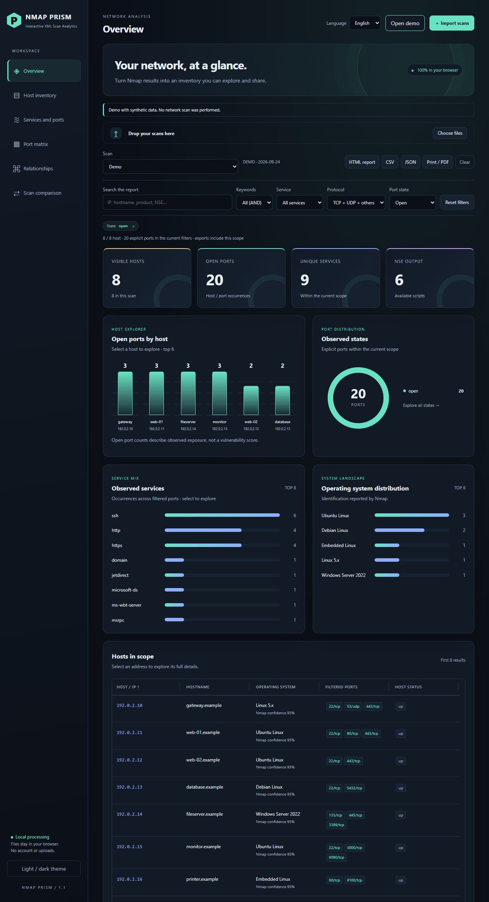
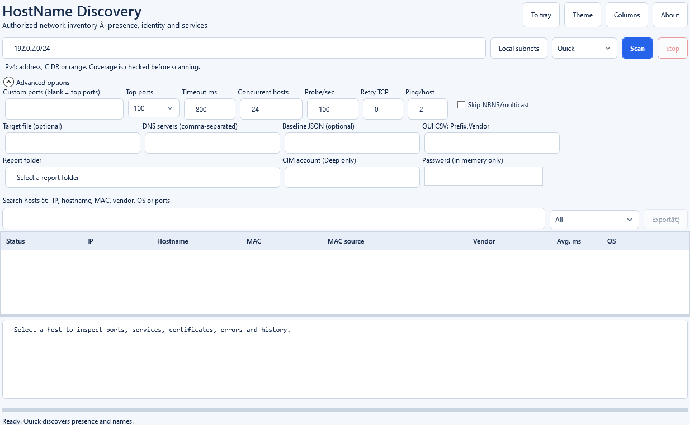
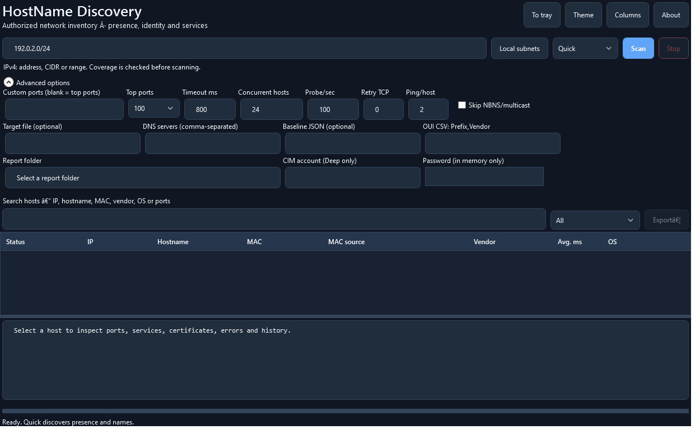

# NMAP-PRISM · HostName Discovery

### Discover hosts. Understand names. Explore your network.

An interactive Windows desktop workspace for turning IPv4 discovery results into a searchable network inventory.


**Windows x64 · WPF desktop GUI · Quick / Standard / Deep · Four report formats**

[**Get the v2.1.6 package**](https://github.com/michele-tn/NMAP-PRISM/raw/refs/heads/main/Golive/v2.1.6/HostNameDiscovery-2.1.6-win-x64.zip?download=1) · [Executable](https://github.com/michele-tn/NMAP-PRISM/raw/refs/heads/main/Golive/v2.1.6/HostNameDiscovery-2.1.6.exe?download=1) · [PowerShell source](https://github.com/michele-tn/NMAP-PRISM/raw/refs/heads/main/Golive/v2.1.6/HostNameDiscovery-2.1.6.ps1?download=1)

> The banner is an illustrated product overview. The desktop GUI, script help, validation messages, and generated report labels are in English.

## Explore Nmap XML online

[**Open NMAP-PRISM online**](https://michele-tn.github.io/NMAP-PRISM/)

Already have a Nmap XML scan? Open the browser-based viewer to explore host inventories, services and ports, a port matrix, relationships, and scan comparisons.

1. Open **NMAP-PRISM online** and select **English** from the language menu.
2. Click **Import scans** or **Choose files**, or drag your Nmap XML file into the import area.
3. Explore the report views and filter by host, service, protocol, or port state.
4. Export the current selection as an **HTML report**, **CSV**, or **JSON**, or use **Print / PDF**.

You can also click **Open demo** to try the viewer with synthetic data. The viewer displays existing scan results; it does not run a network scan. Its interface states that files are processed locally in your browser, without an account or upload.

[](https://michele-tn.github.io/NMAP-PRISM/)

*Actual screenshot of the online viewer using its built-in demo. The hosts and addresses shown are synthetic.*

## Desktop interface

The search field has a persistent label listing the searchable host properties. The inventory also reports the MAC source: ARP cache, ARP, ARP unavailable, or a routed-subnet explanation when the remote MAC cannot be visible from the local network.



<details>
<summary>View the dark theme</summary>



</details>

*Rendered captures of the actual WPF interface using a documentation-only target range. No network inventory is shown.*

## Your network, in focus

Move from a target range to host details in one window. Choose a discovery profile, watch results arrive, search the inventory, and export the findings for further analysis.

| Discover | Inspect | Share |
| --- | --- | --- |
| Enter IPv4 addresses, CIDR blocks, ranges, or a target file. Detect local subnets. | Review hostnames, naming sources, MAC addresses, latency, open ports, and available service details. | Export Nmap-style XML, JSON, CSV, and HTML reports. |
| Adjust timeouts, TCP retries, host concurrency, and probe rate. | Search and filter results, customize columns, and compare against a JSON baseline. | Keep structured data for further analysis and a readable report for review. |

### Choose the depth you need

| Profile | What it collects |
| --- | --- |
| **Quick** | Host presence and name discovery. |
| **Standard** | Adds TCP port discovery. |
| **Deep** | Adds service probes, TLS certificate details where available, and optional authenticated CIM queries. |

Available information depends on DNS records, responding services, firewall rules, permissions, and the selected profile. Vendor identification uses an optional local OUI CSV.

### Coverage and network limits

The target parser accepts IPv4 CIDR prefixes from `/0` through `/32`, IPv4 ranges, and single addresses. A scan still cannot guarantee every field for every host: a firewall may drop probes, DNS may have no reverse record, services may require authentication, and routed networks do not expose remote MAC addresses through the scanner's local ARP table. IPv6 is outside this edition's scope.

To prevent an accidental Internet-scale or enterprise-wide scan, target expansion is bounded at 65,536 IPv4 addresses. Larger CIDRs such as `/8` and `/12` must be divided into authorized smaller ranges. The `-Force` switch bypasses the confirmation prompt for scans above 1,024 targets; it does not bypass the 65,536-address expansion safety limit.

### A workspace built for investigation

- **Dedicated application icon** in the window, taskbar, and Windows notification area.
- **Minimize to tray:** click **To tray** or the window minimize button. Scans continue in the background. Double-click the tray icon or choose **Open HostName Discovery** to restore the window. Use **Exit** to close safely; an active scan is cancelled and partial results are saved. The window close button still exits the app.
- **Light and dark themes** with a Material-inspired visual style.
- **Live progress and cancellation**, including preservation of partial results.
- **Searchable host inventory** with filters and adjustable columns.
- **Host detail panel** for services, certificates, errors, and history.
- **Context actions** for copying identifiers, ping, traceroute, browser access, RDP, SSH, and Wake-on-LAN.
- **Keyboard shortcuts:** F5 to scan, Esc to stop, Ctrl+F to search, and Ctrl+E to export.

## Start with the GUI

1. Download and extract the [v2.1.6 ZIP](https://github.com/michele-tn/NMAP-PRISM/raw/refs/heads/main/Golive/v2.1.6/HostNameDiscovery-2.1.6-win-x64.zip?download=1).
2. Review the [checksums](https://github.com/michele-tn/NMAP-PRISM/raw/refs/heads/main/Golive/v2.1.6/SHA3-256SUMS.txt?download=1) and certificate information below.
3. Launch `HostNameDiscovery-2.1.6.exe`, or run the PowerShell source:

   ```powershell
   powershell.exe -NoProfile -STA -File .\HostNameDiscovery-2.1.6.ps1 -Gui
   ```

4. Enter an authorized target, choose **Quick**, **Standard**, or **Deep**, and start discovery.
5. Select a host to inspect its details, then export the report.

The GUI uses a native Windows/.NET discovery engine. Its source requires Windows PowerShell 5.1; Nmap and Npcap are not required by this GUI edition. Authenticated CIM queries require appropriate credentials and remote access. External context actions may require the corresponding client to be installed.

The executable is packaged with PS2EXE. Version 2.1.6 assigns the application icon to the window and adds minimize-to-tray with restore and exit commands. Source and executable checks cover a loopback GUI scan while minimizing and restoring the window, tray cleanup, search filtering, and theme initialization. These checks do not certify every remote service or network environment.

## Reports that fit your workflow

| Format | Use it for |
| --- | --- |
| **XML** | Nmap-style `<nmaprun>` output for compatible importers. |
| **JSON** | Structured inventory and baseline comparisons. |
| **CSV** | Spreadsheet filtering and downstream processing. |
| **HTML** | A readable inventory report. |

The GUI collects data through its own probes. XML output does not imply that Nmap ran, or that Nmap OS fingerprinting and NSE results are available. Importer compatibility depends on the fields each tool requires.

## Download and verify

| Artifact | Contents |
| --- | --- |
| [Windows x64 executable](https://github.com/michele-tn/NMAP-PRISM/raw/refs/heads/main/Golive/v2.1.6/HostNameDiscovery-2.1.6.exe?download=1) | Packaged GUI with an embedded multi-resolution icon. |
| [Complete ZIP](https://github.com/michele-tn/NMAP-PRISM/raw/refs/heads/main/Golive/v2.1.6/HostNameDiscovery-2.1.6-win-x64.zip?download=1) | EXE, PS1, ICO, public certificate, certificate metadata, and release notes. |
| [Public signing certificate](https://github.com/michele-tn/NMAP-PRISM/raw/refs/heads/main/Golive/v2.1.6/HostNameDiscovery-CodeSigning.cer?download=1) | Public certificate only; no private key. |
| [SHA3-256 checksums](https://github.com/michele-tn/NMAP-PRISM/raw/refs/heads/main/Golive/v2.1.6/SHA3-256SUMS.txt?download=1) | One consolidated checksum list, computed after signing. |
| [Certificate details](https://github.com/michele-tn/NMAP-PRISM/raw/refs/heads/main/Golive/v2.1.6/CERTIFICATE.json?download=1) | Thumbprint, validity dates, and recorded Windows signature status. |
| [Release notes](https://github.com/michele-tn/NMAP-PRISM/raw/refs/heads/main/Golive/v2.1.6/RELEASE.txt?download=1) | Packaging and signature information. |

The EXE and PS1 carry **SHA-256 Authenticode signatures** made with a **self-signed RSA-3072 code-signing certificate**. Windows does not automatically trust this certificate, and it does not establish SmartScreen reputation. The signatures have no trusted timestamp. The private key stays on the build machine and is excluded from the package.

Inspect the executable signature:

```powershell
Get-AuthenticodeSignature .\HostNameDiscovery-2.1.6.exe |
    Format-List Status, StatusMessage, SignerCertificate
```

Package checksums use **SHA3-256**, which differs from SHA-256. For example, with Python installed:

```powershell
python -c "import hashlib,pathlib; p=pathlib.Path('HostNameDiscovery-2.1.6-win-x64.zip'); print(hashlib.sha3_256(p.read_bytes()).hexdigest())"
```

Compare the result with the ZIP entry in `SHA3-256SUMS.txt`.

Use discovery tools only on networks you own or are explicitly authorized to test. Inventory reports can contain sensitive network information.


