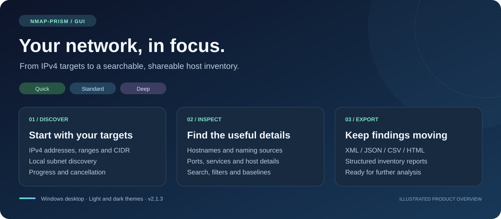

# NMAP-PRISM · HostName Discovery

### Discover hosts. Understand names. Explore your network.

An interactive Windows desktop workspace for turning IPv4 discovery results into a searchable network inventory.



**Windows x64 · WPF desktop GUI · Quick / Standard / Deep · Four report formats**

[**Get the v2.1.2 package**](Golive/v2.1.2/HostNameDiscovery-2.1.2-win-x64.zip) · [Executable](Golive/v2.1.2/HostNameDiscovery-2.1.2.exe) · [PowerShell source](Golive/v2.1.2/HostNameDiscovery-2.1.2.ps1)

> The banner is an illustrated product overview, not an application screenshot. This presentation is in English; the v2.1.2 desktop interface currently includes Italian labels.

## Your network, in focus

Move from a target range to host details in one window. Choose a discovery profile, watch results arrive, search the inventory, and export the findings for further analysis.

| Discover | Inspect | Share |
| --- | --- | --- |
| Enter IPv4 addresses, CIDR blocks, ranges, or a target file. Detect local subnets. | Review hostnames, naming sources, MAC addresses, latency, open ports, and available service details. | Export Nmap-style XML, JSON, CSV, and HTML reports. |
| Adjust timeouts, TCP retries, host concurrency, and probe rate. | Search and filter results, customize columns, and compare against a JSON baseline. | Keep structured data for further analysis and a readable report for review. |

### Choose the depth you need

| Profile | What it collects |
| --- | --- |
| **Quick** | Host presence and name discovery. |
| **Standard** | Adds TCP port discovery. |
| **Deep** | Adds service probes, TLS certificate details where available, and optional authenticated CIM queries. |

Available information depends on DNS records, responding services, firewall rules, permissions, and the selected profile. Vendor identification uses an optional local OUI CSV.

### A workspace built for investigation

- **Light and dark themes** with a Material-inspired visual style.
- **Live progress and cancellation**, including preservation of partial results.
- **Searchable host inventory** with filters and adjustable columns.
- **Host detail panel** for services, certificates, errors, and history.
- **Context actions** for copying identifiers, ping, traceroute, browser access, RDP, SSH, and Wake-on-LAN.
- **Keyboard shortcuts:** F5 to scan, Esc to stop, Ctrl+F to search, and Ctrl+E to export.

## Start with the GUI

1. Download and extract the [v2.1.2 ZIP](Golive/v2.1.2/HostNameDiscovery-2.1.2-win-x64.zip).
2. Review the [checksums](Golive/v2.1.2/SHA3-256SUMS.txt) and certificate information below.
3. Launch `HostNameDiscovery-2.1.2.exe`, or run the PowerShell source:

   ```powershell
   powershell.exe -NoProfile -STA -File .\HostNameDiscovery-2.1.2.ps1 -Gui
   ```

4. Enter an authorized target, choose **Quick**, **Standard**, or **Deep**, and start discovery.
5. Select a host to inspect its details, then export the report.

The GUI uses a native Windows/.NET discovery engine. Its source requires Windows PowerShell 5.1; Nmap and Npcap are not required by this GUI edition. Authenticated CIM queries require appropriate credentials and remote access. External context actions may require the corresponding client to be installed.

The executable is packaged with PS2EXE. Packaging, its embedded signature, ZIP contents, and checksums were checked for this release; these checks do not constitute a complete end-to-end scan test of the executable.

## Reports that fit your workflow

| Format | Use it for |
| --- | --- |
| **XML** | Nmap-style `<nmaprun>` output for compatible importers. |
| **JSON** | Structured inventory and baseline comparisons. |
| **CSV** | Spreadsheet filtering and downstream processing. |
| **HTML** | A readable inventory report. |

The GUI collects data through its own probes. XML output does not imply that Nmap ran, or that Nmap OS fingerprinting and NSE results are available. Importer compatibility depends on the fields each tool requires.

## Download and verify

| Artifact | Contents |
| --- | --- |
| [Windows x64 executable](Golive/v2.1.2/HostNameDiscovery-2.1.2.exe) | Packaged GUI with an embedded multi-resolution icon. |
| [Complete ZIP](Golive/v2.1.2/HostNameDiscovery-2.1.2-win-x64.zip) | EXE, PS1, ICO, public certificate, certificate metadata, and release notes. |
| [Public signing certificate](Golive/v2.1.2/HostNameDiscovery-CodeSigning.cer) | Public certificate only; no private key. |
| [SHA3-256 checksums](Golive/v2.1.2/SHA3-256SUMS.txt) | One consolidated checksum list, computed after signing. |
| [Certificate details](Golive/v2.1.2/CERTIFICATE.json) | Thumbprint, validity dates, and recorded Windows signature status. |
| [Release notes](Golive/v2.1.2/RELEASE.txt) | Packaging and signature information. |

The EXE and PS1 carry **SHA-256 Authenticode signatures** made with a **self-signed RSA-3072 code-signing certificate**. Windows does not automatically trust this certificate, and it does not establish SmartScreen reputation. The signatures have no trusted timestamp. The private key stays on the build machine and is excluded from the package.

Inspect the executable signature:

```powershell
Get-AuthenticodeSignature .\HostNameDiscovery-2.1.2.exe |
    Format-List Status, StatusMessage, SignerCertificate
```

Package checksums use **SHA3-256**, which differs from SHA-256. For example, with Python installed:

```powershell
python -c "import hashlib,pathlib; p=pathlib.Path('HostNameDiscovery-2.1.2-win-x64.zip'); print(hashlib.sha3_256(p.read_bytes()).hexdigest())"
```

Compare the result with the ZIP entry in `SHA3-256SUMS.txt`.

Use discovery tools only on networks you own or are explicitly authorized to test. Inventory reports can contain sensitive network information.
